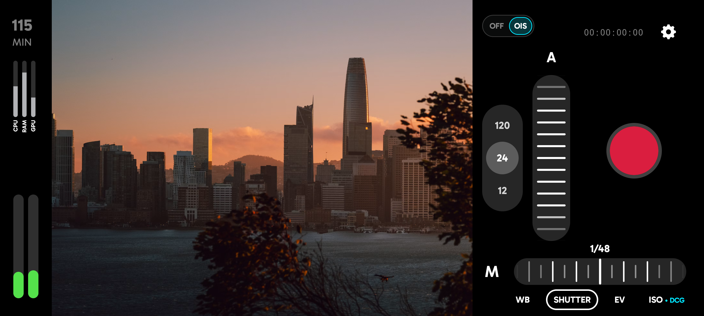

# PixelLog: Zero-Copy Open-Gate Video Subsystem
### Target Platform: Google Pixel 11 Pro (Tensor G6 SoC, 12GB LPDDR5X)
#### Created with Antigravity

**PixelLog** is a lightweight, zero-copy, open-gate (4:3) cinema video recording subsystem engineered specifically for the Google Pixel 11 Pro. It replaces generic lossy mobile video pipelines with a direct raw sensor ingestion engine, bespoke sensor-matched **Pixel-Log** transfer curve, real-time GPU debayering, 10-bit HEVC hardware encoding, and a calibrated DaVinci Resolve post-production grading suite.
<p align="center">
  <br>
  <em>Interface mockup; not actual captured footage.</em>
</p>

---

## 1. Architectural Highlights

* **True 4:3 Open-Gate Ingestion:** Reads the uncropped active sensor matrix ($4080 \times 3072$) using hardware quad-binned `RAW_SENSOR`, preserving 100% field of view without anamorphic crop factor. Supported framerates are **24, 29.97, and 30 fps** — 25/48/50/60 fps modes were removed due to hardware instability on the Tensor G6 RAW_SENSOR pipeline.
* **Preserved Dual Conversion Gain (DCG):** Automatically tracks the sensor's hardware floating-diffusion capacitor transitions (LCG at ISO 50–320 for 40,000 $e^-$ full-well capacity and 12.8 stops DR; HCG at ISO 400+ for 60% read noise reduction and 12.5 stops DR).
* **Bespoke "Pixel-Log" Curve ($\sinh^{-1}$):** Replaces piecewise Apple Log with a branchless Inverse Hyperbolic Sine transfer function. Delivers a **55.5% reduction in GPU ALU instruction load**, eliminates SIMD warp divergence on mobile TBDR GPUs, maps 18% middle grey to cinema standard 0.4000 (code 410), and preserves +6.47 stops of highlight headroom up to $R = 16.0$ (14.2 stops total DR).
* **Bradford-Adapted Color Matrix:** Pre-multiplies sensor spectral sensitivities into standard linear BT.2020 before log compression, permanently eliminating skin-tone hue twisting and metameric failure under narrow-band spectra.
* **Dual-Surface Zero-Stall Rendering:** Multi-threaded shared EGL contexts eliminate `eglMakeCurrent` stalls (saving 1–5 ms/frame), simultaneously routing clean 10-bit Log to `MediaCodec` and a graded preview to the viewfinder `SurfaceView`.
* **LUT Bake-to-Encoder:** Optional GPU Pass 2 mode burns the active 3D LUT directly into the 10-bit recording stream with automatic color space signaling — SDR LUTs tag `BT.709 / SDR`, AgX HLG tags `BT.2020 / HLG` for native HDR playback up to 1000 nits.
* **Hardware Synchronization:** Non-blocking Linux sync fences (`EGL_SYNC_NATIVE_FENCE_ANDROID`) paired with `AImageReader_acquireNextImageAsync` and `AImage_deleteAsync`, maintaining a strictly regulated 3-buffer circular pool with 33.33 ms cadence and zero race conditions.
* **Hardened 10-Bit HEVC / AV1 Bitstream:** Tags the MP4 container with BT.2020 metadata (`KEY_COLOR_STANDARD`, `KEY_COLOR_RANGE`, `KEY_COLOR_TRANSFER`), locks $PTS == DTS$ with zero B-frames to prevent `MediaMuxer` crashes, and prevents Adobe Premiere Pro's black-crush bug.
* **Multi-Lens Switching:** Seamlessly routes between physical 0.5×, 1×, and 5× sensors (12 mm / 24 mm / 120 mm equiv.) with per-lens `SensorProfile` (ISO range, exposure time range, focus distance range, DCG threshold, OIS flags) cached at session open.
* **Stabilization Modes:** OFF / OIS / **GYRO** — GYRO mode disables OIS entirely and starts `GyroflowTelemetryLogger`, writing a frame-accurate Gyroflow CSV 1.3 (`.gcsv`) sidecar for post-stabilization in Gyroflow / DaVinci Resolve. *(EIS and FULL hybrid modes are defined but not yet implemented.)* **Note:** Gyroflow lens calibration profiles for the Pixel 11 Pro 0.5×, 1×, and 5× lenses do not yet exist — footage must be processed with the "plain" preset or a user-supplied calibration until official profiles are contributed to the Gyroflow lens database.
* **Scene Luminance Metering (Native):** `ZeroCopyImporter` performs a center-weighted 32×24 Gaussian grid photometric evaluation on Gr sensels per RAW frame, computing a temporally smoothed EV delta and exposing it via JNI. The `EvMeterView` renders a ±2 EV scale with 60/120 fps damped interpolation.
* **Per-Sensor Hardware Profiling:** On each camera open, the HAL characteristics for all physical sensors are queried and cached into `SensorProfile` structs — including actual ISO range, exposure time range, focus distance, hyperfocal distance, and max analog sensitivity — clamping all user inputs to the physical hardware limits.
* **JSON Sidecar Metadata:** Frame-accurate `.json` written alongside each clip containing lens, ISO, shutter, Kelvin/tint, rolling shutter skew, dynamic black/white levels, color matrices, and PixelLog curve parameters for reproducible post-production.

---

## 2. Color Science & Transfer Function Equations

### Forward OETF (Linear Scene Reflection $\to$ Pixel-Log $[0, 1]$):
$$P = \alpha \cdot \log_2\left( \frac{R - R_0}{s} + \sqrt{\left(\frac{R - R_0}{s}\right)^2 + 1.0} \right) + \beta$$

### Inverse EOTF (Pixel-Log $[0, 1] \to$ Linear Scene Reflection):
$$R = s \cdot \frac{1}{2}\left( 2^{\frac{P - \beta}{\alpha}} - 2^{-\frac{P - \beta}{\alpha}} \right) + R_0$$

### Analytical Constants:
$$\alpha = 0.09499002, \quad \beta = -0.21565232, \quad s = 0.00450000, \quad R_0 = -0.02100000$$

### Critical Code Values:
* **Sensor Saturation / Clip ($R = 16.0$):** $P = 1.000000$ (10-bit code **1023**) — $+6.47$ stops headroom above middle grey.
* **100% Diffuse White Reflector ($R = 1.00$):** $P = 0.622695$ (10-bit code **637**).
* **18% Reflective Middle Grey ($R = 0.18$):** $P = 0.400000$ (10-bit code **410**).
* **Sensor Zero Light ($R = 0.00$):** $P = 0.091989$ (10-bit code **94.1**).
* **Sub-Black Zero Crossing ($P = 0.00$):** $R_{\text{zero}} = -0.010612$ (preserves $>3\sigma$ analog dark noise).

---

## 3. Project Directory Structure

```
PixelLog/
├── app/
│   ├── build.gradle.kts                      # Android NDK / CMake build config
│   └── src/main/
│       ├── AndroidManifest.xml               # Permissions, camera features, landscape lock
│       ├── assets/
│       │   ├── luts/
│       │   │   ├── PixelLog_to_Rec709_Display.cube   # 33x33x33 preview LUT (SDR)
│       │   │   ├── PixelLog_to_Rec2020_Linear.cube   # Scene-linear BT.2020
│       │   │   ├── PixelLog_to_ACEScg.cube           # ACEScg gamut
│       │   │   ├── PixelLog_to_AgX_Base.cube         # AgX Film (neutral)
│       │   │   ├── PixelLog_to_AgX_Punchy.cube       # AgX Film (punchy)
│       │   │   ├── PixelLog_to_AgX_HLG.cube          # AgX HLG HDR (BT.2020/HLG)
│       │   │   ├── PixelLog_to_AgX_Punchy_HLG.cube   # AgX Punchy HLG HDR
│       │   │   └── PixelLog_to_DWG_Intermediate.cube # DaVinci Wide Gamut
│       │   └── shaders/
│       │       ├── debayer_pixel_log.vert    # Fullscreen quad vertex shader
│       │       ├── debayer_pixel_log.frag    # 3x3 directional debayer + Pixel-Log OETF
│       │       ├── lut3d_preview.vert        # Viewfinder vertex shader
│       │       └── lut3d_preview.frag        # 3D LUT sampling (dynamic LUT size)
│       ├── cpp/
│       │   ├── CMakeLists.txt                # NDK CMake script linking GLESv3, EGL, camera2ndk
│       │   ├── include/PixelLogCommon.h      # Common constants, Bayer enums, metadata structs
│       │   ├── ZeroCopyImporter.h/.cpp       # AHardwareBuffer / DMA-BUF zero-copy importer
│       │   ├── LutManager.h/.cpp             # .cube parser & GL_TEXTURE_3D manager
│       │   ├── GpuPipeline.h/.cpp            # Dual-surface EGL, FBO, debayer & LUT shaders
│       │   ├── CameraStreamManager.h/.cpp    # AImageReader async acquire/release fence engine
│       │   └── pixellog_jni.cpp              # JNI boundary implementations
│       ├── java/com/pixellog/
│       │   ├── camera/
│       │   │   ├── CameraController.kt       # Camera2 HAL state machine (multi-lens, stab, AE)
│       │   │   └── ColorScienceUtils.kt      # Planckian CCT, UCS Tint, Bradford matrix
│       │   ├── nativebridge/
│       │   │   └── PixelLogEngine.kt         # JNI bridge to libpixellog.so
│       │   ├── recording/
│       │   │   ├── PixelLogEncoderPipeline.kt# 10-bit HEVC/AV1 encoder, dynamic VUI, MP4 muxing
│       │   │   ├── HevcBitstreamAuditor.kt   # SPS VUI NAL unit verification
│       │   │   ├── Av1BitstreamAuditor.kt    # AV1 sequence header verification
│       │   │   └── GyroflowTelemetryLogger.kt# IMU gyro/accel logger → Gyroflow CSV 1.3 .gcsv
│       │   └── ui/
│       │       ├── CameraActivity.kt         # Cinema-style UI (dial strip, lens pill, perf bars)
│       │       ├── CameraPreferences.kt      # SharedPreferences wrapper
│       │       ├── DialStripView.kt          # Horizontal manual-control dial strip
│       │       ├── EvMeterView.kt            # ±2 EV exposure meter with Gaussian damping
│       │       ├── FocusExposureOverlayView.kt # Touch-to-focus/meter overlay
│       │       ├── PerformanceBarsView.kt    # CPU/RAM/GPU performance bars
│       │       └── PerformanceMonitor.kt     # System resource polling
│       └── res/                              # Layout, drawables, fonts, colors, strings
├── post_production/
│   ├── PixelLog_Transform.dctl               # Production DaVinci Resolve DCTL transform
│   ├── PixelLog_Inverse.dctl                 # Inverse DCTL (Log → Linear round-trip)
│   ├── generate_pixel_log_luts.py            # Python generator for all .cube LUTs
│   ├── PixelLog_to_Rec709_Display_33/65.cube # Display Rec.709 (33 & 65 pt)
│   ├── PixelLog_to_Rec2020_Linear_33/65.cube # Scene-linear BT.2020 (33 & 65 pt)
│   ├── PixelLog_to_ACEScg_33/65.cube         # ACEScg (33 & 65 pt)
│   ├── PixelLog_to_AgX_Rec709_33/65.cube     # AgX Film Rec.709 (33 & 65 pt)
│   ├── PixelLog_to_AgX_Punchy_33/65.cube     # AgX Punchy (33 & 65 pt)
│   ├── PixelLog_to_AgX_HLG_33/65.cube        # AgX HLG HDR (33 & 65 pt)
│   ├── PixelLog_to_AgX_Punchy_HLG_33/65.cube # AgX Punchy HLG HDR (33 & 65 pt)
│   └── PixelLog_to_DWG_Intermediate_33/65.cube # DaVinci Wide Gamut (33 & 65 pt)
├── tests/
│   ├── test_color_science.py                 # Python verification test harness
│   └── test_native_math.cpp                  # C++ FP32 math precision test harness
├── tools/
│   ├── make_luts.py                          # Standalone LUT generation tool
│   └── solve_log.py                          # Log curve solver / optimizer
├── build.gradle.kts                          # Root build script
├── settings.gradle.kts                       # Project settings
└── gradle.properties                         # Build properties
```

---

## 4. Post-Production Grading Workflow

### DaVinci Resolve Studio (DCTL Installation):
1. Copy `post_production/PixelLog_Transform.dctl` to DaVinci Resolve's LUT directory:
   * **macOS:** `~/Library/Application Support/Blackmagic Design/DaVinci Resolve/LUT/PixelLog/`
   * **Windows:** `%APPDATA%\Blackmagic Design\DaVinci Resolve\Support\LUT\PixelLog\`
   * **Linux:** `~/.local/share/DaVinciResolve/LUT/PixelLog/`
2. In DaVinci Resolve, apply the DCTL to the first node of your clip.
3. Select **Transform Mode:** *Pixel-Log to Scene-Linear BT.2020 (Inverse)*.
4. Set your timeline working color space to **DaVinci Wide Gamut / Intermediate** or **ACEScg**.

### DaVinci Resolve / Premiere Pro / Final Cut Pro (3D LUTs):
* **Quick Display Conversion:** Apply `post_production/PixelLog_to_Rec709_Display.cube` for instant filmic tone reproduction with highlight knee and Rec.709 gamut compression.
* **Color Managed Workflow:** Ingest `post_production/PixelLog_to_Rec2020_Linear.cube` as an unclipped scene-linear input LUT.

---

## 5. Verification & Acceptance Testing

Run the automated mathematical and color science verification suite:
```bash
python3 tests/test_color_science.py
clang++ -std=c++20 -O3 tests/test_native_math.cpp -o tests/test_native_math && ./tests/test_native_math
```

**Verification Results:**
- [x] Middle grey $R = 0.18 \implies P = 0.4000$ ($10\text{-bit code } 409.2$) verified within $10^{-4}$ tolerance.
- [x] Highlight clipping $R = 16.0 \implies P = 1.0000$ ($10\text{-bit code } 1023.0$) verified within $10^{-4}$ tolerance.
- [x] Zero light level $R = 0.0 \implies P = 0.0920$ ($10\text{-bit code } 94.1$) verified.
- [x] Forward $\leftrightarrow$ Inverse roundtrip precision verified ($< 3.74 \times 10^{-6}$ error across 14.2 stops).
- [x] Strict monotonicity and $C^1$ continuity verified across 10,000 steps ($< 1.09 \times 10^{-3}$ derivative finite-difference error).
- [x] Both 33x33x33 `.cube` LUT files verified with exactly 35,937 triplets and correct DOMAIN bounds.
- [x] DaVinci Resolve DCTL syntax, parameters, and bidirectional transforms validated.
- [x] C++ single-precision FP32 implementation verified ($< 1.91 \times 10^{-5}$ maximum roundtrip error).
